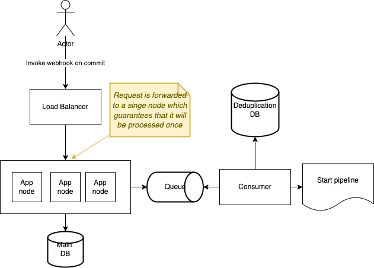

# JB Build Tracker
This application is responsible to keep track of registered CI/CD workflows and 
allow customers to trigger of workflow using a webhook or on a scheduled base.

Application follow **clean architecture principles** and the use-cases, with gateway and domain objects are stored in [domain](domain) module
and actual implementation is stored in [infrastructure](infrastructure) together with endpoints.

## Domain object explained:
[WorkflowRegistration.kt](domain/src/main/kotlin/md/gvart/buildtracker/domain/entity/WorkflowRegistration.kt)

| Field            | Description                                                                                                                                                                                                               |
|------------------|---------------------------------------------------------------------------------------------------------------------------------------------------------------------------------------------------------------------------|
| projectKey       | The unique key generated by external service, which is used to group all workflow for a specific project (also this key should be used by auth-service to verify if customer is allowed to invoke an endpoint for project |
| repositoryUrl    | url to git repository                                                                                                                                                                                                     |
| branches         | list of branches which should be used for workflow triggering                                                                                                                                                             |
| pipelineFileName | the name of file which should be used to trigger the pipeline                                                                                                                                                             |
| triggerType      | Describes type of the Workflow                                                                                                                                                                                            |
| options          | A map of any extra options which may be necessary for workflow tuning (i.e. cron-expression for SCHEDULED pipelines, worker type, etc.)                                                                                   |
## Hot to run and test locally
Application provides two endpoints (can be accessed on [Swagger-UI](http://localhost:8080/documentation)):
- [POST] `/api/v1/workflows` to register a workflow
- [GET] `/api/v1/workflows/webhook` to trigger a workflow

**To run application locally:**
1. Start dependency services(DB and output queue) using `docker-compose up` in root folder
2. Run application using [Bootstrap.kt](infrastructure/src/main/kotlin/md/gvart/buildtracker/Bootstrap.kt) class

## Reflections about selected approaches

* **On Commit**
> From the investigation I did I discovered that there are two ways to trigger a pipeline when a commit occurred.
> 
>  **First** is by pulling, basically our application has a list of repositories with corresponding branches which should be monitored 
> in a fixed interval (i.e. every 15 seconds), whenever a new commit was detected, pipeline is triggered.
>  **Pros:** Easy to set up (no need in extra actions from the client),
>  **Cons:** 1. A bit of delay before pipeline is triggered, 2. Required **orchestration**/**deduplication logic** when runs in multi-node setup, 3. More expensive (in terms of resource usage), since it does extra HTTP calls to VCS.
> 
> **Second** is by pushing (webhook), whenever a commit occurs, client is responsible to invoke an HTTP endpoint with metadata (commit,branch,repo)
> 
>  **Pros:** 1.Easily can run in multi-node setup (without any orchestration in place), since request gets forwarded by LB to a single node, 2. Fewer resources are being used since application is not doing any extra calls. 
>  **Cons:** 2.Requires client to implement the webhook logic on his side.

* **On schedule**
> To trigger the workflow, all scheduled requests have to be stored in a database, the most important columns 
> would be the **cron_expression** and **last_execution_date_time**, using these fields application can schedule internally tasks which will push the messages to the queue following required delay/time 
> , to guarantee that job is scheduled just once in a multi-node setup, an optimistic-lock will be used since expected number of collisions is small.
> To achieve this behavior out of the box **jobrunr** or **Quartz** libraries can be used, in this project **jobrunr** was used.
> 
> **How jobrunrs handles multi-node setup:**
> JobRunr uses optimistic locking to make sure that a job is only processed once. Concretely, this means that 
> when a server starts processing a job, it first changes the state to PROCESSING and tries to save that to the database. 
> If that fails, it means that the job is already processing by another server and the current server will not process it again.
> If it succeeds, it means that the job is not being processed by another server and the current server can process it.

## What can be improved
Since the solution I provided is just a show-case of how I write code, tackle the problems and in general how I think,
some in depth things I left incomplete on purpose (and wrote comments how I'd handle it in a real life scenario, see <side_node> tag). (like validation, user-experience, etc.) 

**What I'd improve**
1. Add more validations steps
2. Allow customers to create scheduled build using  Intervals(i.e. P5D), Date Time, etc.
3. Add more metrics to track SLA,configure monitoring and tracking using micrometer and push all these metrics to DataDog/Prometheus/Elasticsearch
4. Assuming that we have authentication service, I'd verify that user has access to register workflows for a specific projectKey 
 